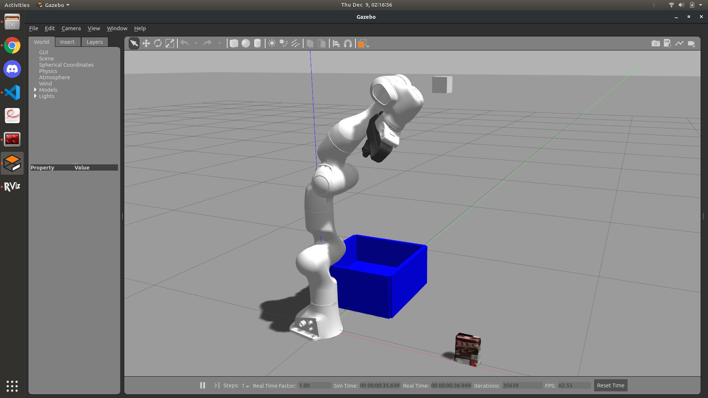
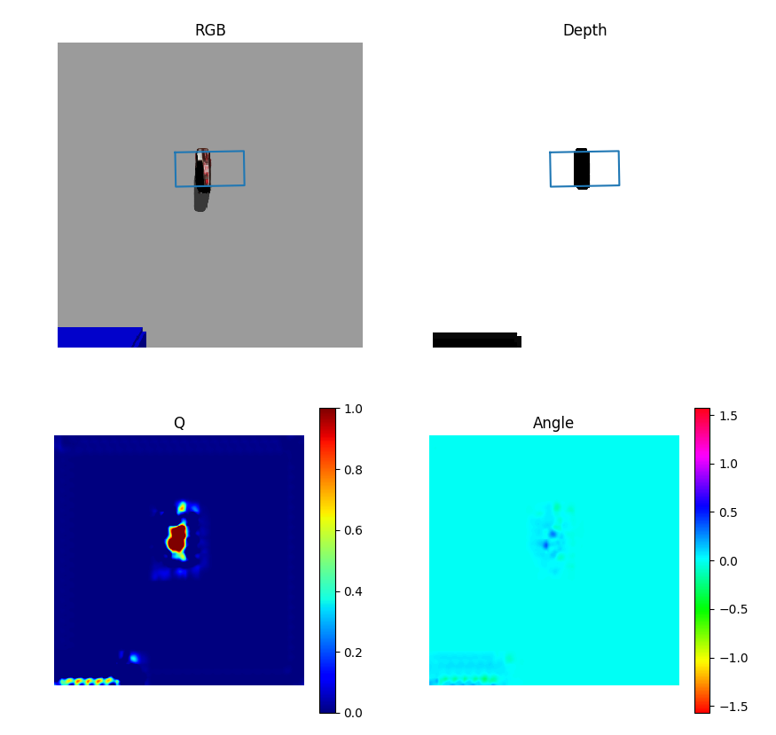
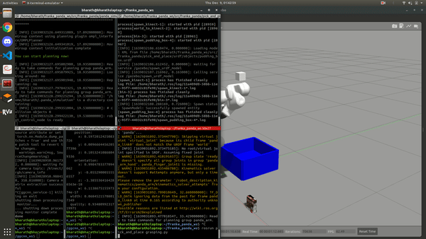

Directed Research under Prof Berk Calli (Worcester Polytechnic Institute)

This is currently a reimplementation of the paper [Learning robust, real-time reactive robotic grasping](https://github.com/dougsm/mvp_grasp "Learning robust, real-time rective robotic grasping") in Gazebo

Refer my [Franka Panda](https://github.com/cdbharath/franka_panda "Franka Panda") repository for the manipulation pipeline used in this project. 

## Learning Based Grasp Synthesis

Grasping setup (left). Grasp prediction using GGCNN (right).

 Executing the grasp in Gazebo after prediction.

## References:
1. [GGCNN ROS wrapper](https://github.com/dougsm/mvp_grasp "GGCNN ROS wrapper")
2. [Learning robust, real-time reactive robotic grasping](https://github.com/dougsm/mvp_grasp "Learning robust, real-time rective robotic grasping") 
